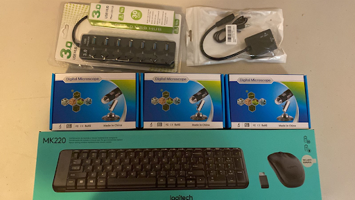

Appendix 1\. Lab protocol for preparing plants and obtaining water potential and % embolism accumulation with simplified optical method

Parts list (with links to find product) 

• Measurement of water potential:

  \- Scholander-type pressure chamber (PMS 1000, PMS instruments, Corvallis OR, USA) [product link](https://www.pmsinstrument.com/category/01-pressure-chamber-instruments/)

  \- Magnifying glass or stereoscopic microscope. [product link](https://www.amazon.com/Handheld-Magnifying-Shatterproof-Magnifier-Non-Slip/dp/B08NW9NWKX/ref=sr_1_8?crid=2FI4JINECNGMJ&dib=eyJ2IjoiMSJ9.Pgn-r7xoZgLyNhg4fmq7Tu0LtSoLj73G4yUIU8iRkjpgalufvTjqSu1pGBxfSe4QEsJEKpvkQJ-vMFVX-lhDEN0UuxNiT110DxaLKe2KcjJgghzXcGoJ_ZZ1Zg-2eCuRHn25dnGNXa7YyZltfZRXrQaNW17nAYcNd0E2ezpHBrjBDCSBpli035W4S92vUIvMBRnaHiohuAszWC1xr0ZS9v4wjzHfXc_GhSG9zKvm9712GnHJ5YKfs6M9udZJzuW1NbrIzmdhr9jOf1nyl2iOr3q8sk-ncUof7m3qBk0qE0g.YX5UIM_LOeUGbeDefmbrIWSfROj0fsQKXsyEWw2I94I&dib_tag=se&keywords=magnifying+glass&qid=1733775583&sprefix=magnifying+glas%2Caps%2C141&sr=8-8)

  \- Resealable zip-top bags. [product link](https://www.amazon.com/Amazon-Basics-Sandwich-Storage-Previously/dp/B095PQ6SX7/ref=sr_1_5?crid=1KEV5HTOQWW2F&dib=eyJ2IjoiMSJ9.XgFVPXQmo_xqTqxcwavTZjGoYzw6-kPfUWL9ELmg6hl38-mYrgDy4vS2A-qMPxtF5-Azi5WXzmIQ690rD_1JSdQbfUwlRDe6REeQR5F1MwqW7dztzUy5FP3LpzO2cFalePPDemtUZFZom3IQRbnBIF50XKxrlI4Vg4tqjk5Eil1BthmnA0MXbk1HciDs-Rokmupob119-ynfvUSmKD1bgtoO4pYm7v8ZV0u5lbwldLIwHzQkqDvBfV9IG6qb1MAVnkmigcWSDKDe3q9jbLZbsSfafN1ZDGPVztQeWlD6fMY.CXqE9w0IvTeeuAVZpugfhwZA4sv5Heeiyfrs5sFmSmk&dib_tag=se&keywords=resealable+ziplock+bags&qid=1733775644&sprefix=resealable+zi%2Caps%2C193&sr=8-5)

  \- Wet absorbent paper. [product link](https://www.amazon.com/Scott-Towels-Absorbent-Multi-Purpose-Disposable/dp/B07L2HNHK7/ref=sr_1_3?crid=29N6GH6UX5IM&dib=eyJ2IjoiMSJ9.9FzU7YeO6h4hLAGJma3_E63wKX67IafC93OS5_SOG9ky2pLlE732YzcITX2B5YuHCmzBSAvgPqrxWAuKoirhk6-O7nNpSOBR9WcZNY4SpA8S438fVcL6Cr8eXMIN1wODY5MMTi59JBzFkKHnLx1Otiz6K2QMPvCk0ung-ogoEsBCKzaRvH6FyofXfgygpKAxj-f8U6Drt5R_sUudt1FWQHH0G9LTqMoBNEjR43kyHEQ.XxGlzgrlo9uCZtndEuWmPbKPyB-ufCzgLBv-pscExVQ&dib_tag=se&keywords=blue%2Babsorbent%2Bpaper&qid=1733775718&sprefix=blue%2Babsorbent%2Bpaper%2Caps%2C141&sr=8-3&th=1)

• Measurement of cavitation events (Figure A 1):

  \- Four Generic USB microscopes (USD 19.66 per microscope). These microscopes are low-cost and can be easily acquired from commercial venues (Amazon or Steren- Latin America) (Figure A 2). [product link](https://www.amazon.com/Microscope-Bysameyee-40X-1000X-Magnification-Endoscope/dp/B07BF86SRP/ref=sr_1_1_sspa?crid=247623ZPI89MX&dib=eyJ2IjoiMSJ9.dSMKMRHya2Ar0HOlOfzqXxPFA_PiqcWKTfXCHym3HpkMl0oKxwuPezB-5zXMDBQMxamZAw4jJjs8S30rtoXMVHViiJqaVFUpiqr3WAV2QtJROIBczCtPn58BlzzlxlDtna8PegMUzDRV3sfFaVBYLigRgUlM2djE_wIlzmsPkoAab6QdAiv1urs4gqgH2cgwqo3RvFxE67SWoBNXIot7IGXJBe67fQjjuOODTWPQtP4.ftUvvxJQCr8jiyIqZmrddLedljDVw9d7knrhGBqvUes&dib_tag=se&keywords=usb+microscopes&qid=1733775782&sprefix=usb+microscopes%2Caps%2C147&sr=8-1-spons&sp_csd=d2lkZ2V0TmFtZT1zcF9hdGY&psc=1)

  \- Monitor [product link](https://www.ebay.com/sch/i.html?_from=R40&_trksid=p4432023.m570.l1313&_nkw=used+monitors&_sacat=0)

  \- Keyboard, mouse. [product link](https://www.amazon.com/Amazon-Basics-Rechargeable-Wireless-Keyboard/dp/B0CJFB8J7B/ref=sr_1_7_ffob_sspa?crid=1G7ZZP08HCU4Q&dib=eyJ2IjoiMSJ9.Vjjs75090grtZFwUTLN5GkUgxkpARM2nRjnnQKiKlfviNczKKH6oV6cE6fapeTg9VR1MpV68uqUflw50U7nCn9zHow5vjLaUsNGETEFxaf0NsqtAFXak8xqDpHG2qYFvC8IuDm-tT1B__-CpRSeAm6toDCJzYJuBlqH7J9iaWrFBfair7V7fkMu4hBqh2HsuFuG0DnvqAB4PyF_vpg3yf8-0SU29L58Wmy2Zj4EvaGc.DC5e24okPI51yh90GB1PDddk7t-HnAgq2qoPatY9kU8&dib_tag=se&keywords=keyboard+and+mouse&qid=1733776806&sprefix=keybo%2Caps%2C169&sr=8-7-spons&sp_csd=d2lkZ2V0TmFtZT1zcF9tdGY&psc=1)

  \- Desktop computer or Raspberry Pi. [product link](https://www.amazon.com/CanaKit-Raspberry-Starter-Kit-PRO/dp/B0CRSNCJ6Y/ref=sr_1_1?crid=LIHTLX2CUEF6&dib=eyJ2IjoiMSJ9.l-BqsrQVZQ1hEJh6W55CEH7cxhx4feHGDRlh3j7eduYKwJ3QnkBK4ADb5Fs-kUHY0jYhPtfwU4ETw2y10mbHlxsMJ2QqKgfnbdZ6Y2yCIFADDy6zyiUbSRVvOUyecoi2qst7CyMX0OpoAwPb1eS5Hxs3sYtMBqmyvmhq-fFI77oxCgoAhEPYZORLEwD7x6ediMiogTXTexs-2yIKqj0gt5aSHGtrC91XY_S8HskoTFI.PcTGg6bq_GJhH5Wo1SXuMZ9wz03Wl_mOfHvzZ3SvH9I&dib_tag=se&keywords=raspberry+pi&qid=1733776866&sprefix=rasp%2Caps%2C221&sr=8-1)

  \- External light (LED lamps). [product link](https://www.amazon.com/Hilngav-Pocket-Flashlight-Rechargeable-Powerful/dp/B0CQ7YNDQ5/ref=sr_1_4_sspa?crid=4WSZGKI4PKEH&dib=eyJ2IjoiMSJ9.iIEih-CUizLJITZXiCkMHtWxgj1Lydvz_JG8M5JPnhEN9Rl9V3FK8XpMvi7acx_3oYyGT9L0Ktpi3ChYAOVCJU19x8OsT4qFl62Ik3r5De0YkqKM27SiQZeOUcQ4sZgIGzThlHAB3rzvlVLBwGPZC_mqU_EDZgssRyGWG91mkQJ7tFfc4dplTrcCpYdrd0mHVvynoYh5Ms29gKxjtLtr4b6hb5KpoQ4nfrRQRq49hmivLM2xzJ9kU4MbK-xU_j6cIuNV2geWojMnEG56FDYUBm-s31G93A_zkgLATSPfr1g.Mivg-qYJtHpq1ZXtyVZuP7Il4eJjTNxo9lY-vNWGHwM&dib_tag=se&keywords=5PCS+Linterna+LED+recargable%2C+mini+linterna+LED%2C+linterna+de+mano+con+luz+lateral+Cob%2C+5+modos+de+iluminaci%C3%B3n+linterna+para+camping%2C+senderismo%2C+correr%2C+uso+de+emergencia+en+cortes+de+energ%C3%ADa&qid=1733778516&sprefix=5pcs+linterna+led+recargable%2C+mini+linterna+led%2C+linterna+de+mano+con+luz+lateral+cob%2C+5+modos+de+iluminaci%C3%B3n+linterna+para+camping%2C+senderismo%2C+correr%2C+uso+de+emergencia+en+cortes+de+energ%C3%ADa%2Caps%2C182&sr=8-4-spons&sp_csd=d2lkZ2V0TmFtZT1zcF9hdGY&psc=1)

  \- Silver tape (duct tape). [product link](https://www.amazon.com/Nashua-1-89-Heavy-Duty-Model/dp/B08484P9XD/ref=sr_1_16?crid=1XSFH8A4O8W89&dib=eyJ2IjoiMSJ9.BUevMK4jdVfkISmP3KrbY--Ne3_5spExK63PeFWT15twq9f23-JRa8c53wMnSTMGP1EJTHe4v2BC_yMaRuDnFRyBsr5b9UlPvKWOvkepRoVgZV2fs2kObc_YdTWics1rTn1Mn4a08qZx4olp2QSZOtNLVvG7nDIwr-mLw5gh7ewRB-ItWSfwwYiRNyR5wlzTShhpxFxHOoAfEFUyEBsg2oftkQuQHjDIdVQksaiZ0Yg.QaHZBrFxWlsCJ6-SoIvnlnwEKmSJHVMmjZHrlRDwz0s&dib_tag=se&keywords=duct+tape&qid=1733778578&sprefix=duct+%2Caps%2C165&sr=8-16)

  \- Microscope supports [product link](https://www.amazon.com/Jiusion-Aluminium-Adjustable-Professional-Microscope/dp/B0797PPX8D/ref=sr_1_3?crid=LI2Q8WBQWWVM&dib=eyJ2IjoiMSJ9.ZCyqMUELHw428iOGcrSgWXf6FcVv5nssQlyL817rN4qh2MMZfc7ugs8nU4CoGjnUuX54AEzgP6F7ts2V0TLu4N2KzwWYjLkhfNMVLsFZF_1GyBbKLfL9mdVfcFrCXSW578xsoHHEAQeZJKGSTq4vvwitzR81VpKSQKb42ubWIymnbaHgXhxbtd_ap2z3xW9GPYJnrq9iP5WzMj0p9o_f49_DnljgmYqJwXBLW3SEBHk.momRgz5OMImgPgnnaFFl8tOR0Ng-RKaC31JxMBpL7rg&dib_tag=se&keywords=usb+microscope+stand&qid=1733778679&sprefix=microscope+usb+s%2Caps%2C133&sr=8-3)

  \- Plywood [product link](https://www.amazon.com/Artificer-Plywood-Basswood-Cutting-Painting/dp/B0CNVML27N/ref=sr_1_9?crid=LPLLZZXKUKA9&dib=eyJ2IjoiMSJ9.vFSjmRkgXZOCFC8JcHZtKk3wIiMIdgXGuZ8Lz7yNQeZpY4QM87GLwjVS2Beko-Y5cX9PhSJOuJvQn9tHfXFnjVMIhSXOJbtRzQTg_JanyY1S3SLsbHUZGZ4D17vg-FI2e70KiCMoADDN8DW5bXx0DQYtz-qO0GduuVS3026oLws2eUjCpaUsVpOjwoEPhGZXHc_jQssDeeeZTTnC-H_xyDMsfdV-Tjwejwp5ZAWl-_IEJPf03CbZ9W0FGdb8Cj4fNxetPzeXLYrgOuGYqj-AXNnLgNDGz84Fkr6P2NUrs8Q.Z6LjZ7iBlQCrFTxtfgU3TJhar9XK7KFo15wfz4mAR6I&dib_tag=se&keywords=plywood&qid=1733778729&sprefix=plywood%2Caps%2C147&sr=8-9)

  \- Wire Clips & Screws [product link](https://www.amazon.com/Hilitchi-Mounting-Fastener-Assortment-Management/dp/B07YDS52P7/ref=sr_1_19?crid=10PUT75ZBCUZP&dib=eyJ2IjoiMSJ9.pvFDR5q8DJL8TnGhKOVh9ZXxB5DDRwwzGWqy6YVTdDoDWTaclTryD_kqRoHrI3ZTpmx83fpPalb0HJ1oUnhnA3l_XBq54oLg9DppeRwMXYr1ZYaWqhaMekXRWJaR8K2w_SDagLa9Kdat3RH0u1Ic3SWRqgRH4Sx5x6QUa-jm24aZjkoOle0hO8gHJJm9p7BHTG0cmXIU1twdrGLj33EpEFFb-13QD7iskcFyFDSKU5k.SpjDwlR2HwRgnCx14Bc3tVvbc3Oa4qXi1v3v4vUjn-I&dib_tag=se&keywords=Nylon+Plastic+R-Type+Wire+Clips+and+screws&qid=1733778981&sprefix=nylon+plastic+r-type+wire+clips+and+screws+%2Caps%2C230&sr=8-19)

  \- Cosmetology nail file [product link](https://www.amazon.com/Metal-Nail-File-Set-Anti-Slip/dp/B0DHBZ16H6/ref=sr_1_14_sspa?crid=1O0RZUHQLNG3P&dib=eyJ2IjoiMSJ9.RLhf9D_W3ScKI4GO8OhK4_48HWSzL0HodOkznYQXHQ_5OaPTXZGk1GIw7G9djUc_mOe0KVAuUT5vzFXOlt1D25vL9G1481LKX1QQl3pGN1MijffhAXkKjiaJAiNGdF19y0Ez3JHmiQhOE9QCiXVOAhH2ipD4JTzF5LvTgyyqDKSv9LTWH-1UgdQsLeNnxcVYGxDSNccSCbpFWfuSFA7Tr_g27lWN6xrQAFsx-p5O6wDkCGqnFWsflS2VaKTcL2NQTEhL-lpFiZnaKw4Zdmrx9d11RJzh2M_xjGkTEEYxeOA.zMaQJuEJN20qG8fe31NjYruke5EbsB93cmeOglhXc0I&dib_tag=se&keywords=cosmetology+nail+file&qid=1733779117&sprefix=cosmetology+nail+file%2Caps%2C158&sr=8-14-spons&sp_csd=d2lkZ2V0TmFtZT1zcF9tdGY&psc=1)

  \- Tensive Conductive Adhesive Gel [product link](https://www.parkerlabs.com/products/tensive-conductive-gel/)

  \- Required software: 

\- ImageJ [software link](https://imagej.net/ij/download.html)

\- Python [software link](https://www.python.org/downloads/)

 

Figure A 1 Part of the material used to measure % of cavitation accumulated

 ![][image2]

Figure A 2 USB microscopes used. 

 ![][image3]

Figure A3 (a) Screen showing the activated program. In the upper left corner, the four images of the microscope are displayed, and on the right, the verbose output indicates the status

A)	Procedure for preparation of equipment

1\.	Microscope Setup:

o	Acquire four microscope stands and four USB microscopes.

2\.	Mounting the Equipment:

o	Cut a piece of birch plywood to 160 cm x 50 cm x ½ inch.

o	Perforate the microscope bases and attach them with secures into the plywood.

o	Use screws and wire clips to secure branches and stems to the plywood and to the microscope stands.

3\.	Lighting Adjustment:

o	Disable the integrated LED lights in the microscopes.

o	Set up external diffused lighting using LED lanterns to reduce reflections on moist plant tissues.

4\.	Image Acquisition Software:

o	Use Python programs in appendix 3 and 4 to capture photos from all four microscopes every 4 minutes.

o	Ensure simultaneous image display, calibration, and time-stamped saving for later analysis.

5\.	Microscope Arrangement in Dark Room:

o	Set up the microscopes in a dark room to minimize external light interference.

o	Arrange the water potential measurement station outside the dark room.

B)	Procedure for measurement of P50

•	Collection of Samples

•	Species: Select study species. 

•	Branch Length: Approximately 50 cm for each sample.

•	Rehydration: Rehydrate branches for 24 hours in buckets of water covered with black bags.

•	Xylem Exposure

•	Use a cosmetology nail file to remove the bark and expose the xylem tissue. File away the hard outer bark and manually peel off the phloem using a small razor or fingernail until the white-yellowish xylem is visible.

•	Preventing Desiccation

•	Apply Tensive Conductive Adhesive Gel to the exposed xylem to prevent desiccation and enhance visibility under the microscope.

•	Imaging 

•	Place the branches under the microscopes in the dark room and begin image acquisition.

•	Water Potential Measurement:

•	Bag the branches for 15 minutes after incision, with moist paper towels inside the bag.

•	Use a pressure chamber for measuring water potential.

•	Measure water potential every 6 hours for the first 3 days, then at 12 pm daily.

•	Prepare vulnerability to cavitation curves

•	Follow the methodology outlined by Lucani and Brodribb (2023) using the Fiji software (Fiji Team, 2023, https://imagej.net/software/fiji/) and Excel (Microsoft 2024\) to obtain the curves.
